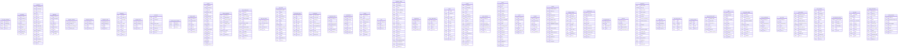

```mermaid
erDiagram
    acl_group_members {
        string created_at
        string created_by
        string group_id
        string user_id
    }
    acl_groups {
        string created_at
        string created_by
        string description
        string id
        string modified_at
        string name
        string native_type
        string parent_id
        Json settings
    }
    campaigns {
        string completed_at
        string created_at
        string group_ids
        string id
        string lang
        Json meta
        string name
        string owner_id
        string page_id
        string page_slug
        string scheduled_at
        string started_at
        Json stats
        string status
        string subject
        string tracking_id
        string updated_at
        Json vars
    }
    categories {
        string created_at
        string description
        string id
        Json meta
        string name
        string owner_id
        string slug
        string updated_at
        json visibility
    }
    category_relations {
        string child_category_id
        string created_at
        string parent_category_id
        json relation_type
    }
    collection_pictures {
        string added_at
        string collection_id
        string id
        string picture_id
    }
    collection_posts {
        string collection_id
        string created_at
        string id
        string post_id
    }
    collections {
        Json content
        string created_at
        string description
        string id
        boolean is_public
        Json layout
        string name
        string slug
        string updated_at
        string user_id
    }
    comment_likes {
        string comment_id
        string created_at
        string id
        string user_id
    }
    comments {
        string content
        string created_at
        string id
        number likes_count
        string parent_comment_id
        string picture_id
        string updated_at
        string user_id
    }
    contact_group_members {
        string added_at
        string contact_id
        string group_id
    }
    contact_groups {
        string created_at
        string description
        string id
        Json meta
        string name
        string owner_id
        string updated_at
    }
    contacts {
        Json address
        string created_at
        Json emails
        string first_name
        string id
        string language
        string last_name
        Json log
        Json meta
        string name
        string notes
        string organization
        string owner_id
        string phone
        string source
        string status
        string tags
        string title
        string updated_at
    }
    context_definitions {
        string created_at
        Json default_filters
        Json default_templates
        string description
        string display_name
        string icon
        string id
        boolean is_active
        string name
        string updated_at
    }
    filter_usage_logs {
        string context
        string created_at
        string error_message
        string filters_applied
        string id
        number input_length
        string model
        number output_length
        number processing_time_ms
        string provider
        boolean success
        string template_id
        string user_id
    }
    grid_area_places {
        string created_at
        string grid_area_id
        string id
        string place_id
        number rank
    }
    grid_areas {
        number area_sqkm
        Json bbox
        Json center
        string created_at
        Json geometry
        string gid
        string id
        number level
        number max_dist_km
        Json meta
        string name
        string region
        Json stats
        string updated_at
        string user_id
    }
    grid_search_runs {
        string created_at
        string id
        string parent
        Json request
        Json result
        string run_id
        Json settings
        string status
        string updated_at
        string user_id
    }
    n_glossaries {
        string creation_time
        number entry_count
        string glossary_id
        string hash
        string local_created_at
        string local_updated_at
        string name
        boolean ready
        string source_lang
        string target_lang
    }
    n_glossary_terms {
        string created_at
        string id
        string source_lang
        string target_lang
        string term
        string translation
        string updated_at
    }
    n_translations {
        string created_at
        string dst_lang
        string dst_text
        string id
        Json meta
        string src_lang
        string src_text
        string updated_at
    }
    layouts {
        string created_at
        string id
        boolean is_predefined
        Json layout_json
        Json meta
        string name
        string owner_id
        string type
        string updated_at
        json visibility
    }
    likes {
        string created_at
        string id
        string picture_id
        string user_id
    }
    marketing_emails {
        string campaign
        string created_at
        string email
        string error_message
        string from_address
        string id
        string lang
        string last_retry_at
        Json meta
        string name
        string page_slug
        number retry_count
        string sender_id
        string sent_at
        string status
        string subject
        string tracking_id
        string unsubscribe_token
        boolean unsubscribed
        string unsubscribed_at
        string updated_at
    }
    organizations {
        string created_at
        string id
        string name
        string slug
        string updated_at
    }
    page_collaborators {
        string created_at
        string id
        string page_id
        json role
        string user_id
    }
    pages {
        Json content
        string created_at
        string id
        boolean is_public
        string is_version_of
        Json meta
        string owner
        string parent
        string slug
        string tags
        string title
        string type
        string updated_at
        boolean visible
    }
    pictures {
        string created_at
        string description
        string flags
        string id
        string image_url
        boolean is_selected
        number likes_count
        Json meta
        string organization_id
        string parent_id
        number position
        string post_id
        string tags
        string thumbnail_url
        string title
        string type
        string updated_at
        string user_id
        boolean visible
    }
    place_searches {
        string created_at
        string id
        string input_hash
        Json input_params
        string result_place_ids
        string run_id
        string user_id
    }
    places {
        string address
        string city
        Json contacts
        string continent
        string country
        string created_at
        string description
        Json gps_coordinates
        Json media
        Json meta
        Json operating_hours
        string phone
        string place_id
        Json raw_data
        string thumbnail
        string title
        string types
        string updated_at
        string user_id
        string website
    }
    posts {
        string created_at
        string description
        string id
        Json meta
        Json settings
        string title
        string updated_at
        string user_id
    }
    products {
        string created_at
        string description
        string id
        string name
        Json settings
        string slug
        string updated_at
    }
    profiles {
        string aimlapi_api_key
        string avatar_url
        string bio
        string bria_api_key
        string created_at
        string display_name
        string google_api_key
        string huggingface_api_key
        string id
        string openai_api_key
        Json pages
        string replicate_api_key
        Json settings
        string updated_at
        string user_id
        string username
    }
    provider_configs {
        string base_url
        string created_at
        string display_name
        string id
        boolean is_active
        Json models
        string name
        Json rate_limits
        Json settings
        string updated_at
        string user_id
    }
    resource_acl {
        string created_at
        string group_name
        string id
        Json log
        Json meta
        string path
        string permissions
        string resource_id
        string resource_owner_id
        string resource_type
        string updated_at
        string user_id
    }
    role_permissions {
        string created_at
        string id
        json permission
        json role
    }
    searches {
        string created_at
        string id
        string input_hash
        Json input_params
        string result_place_ids
    }
    transactions {
        string buyer_email
        unknown buyer_ip
        string buyer_name
        Json buyer_profile
        string created_at
        string currency
        string external_checkout_id
        string external_order_id
        string id
        Json metadata
        string note
        string payment_provider
        Json product_info
        Json shipping_info
        string status
        number total_amount
        string updated_at
        string user_id
        Json vendor_info
    }
    type_casts {
        json cast_kind
        string description
        string from_type_id
        string to_type_id
    }
    type_enum_values {
        string id
        string label
        number order
        string type_id
        string value
    }
    type_flag_values {
        number bit
        string id
        string name
        string type_id
    }
    type_structure_fields {
        Json default_value
        string field_name
        string field_type_id
        string id
        number order
        boolean required
        string structure_type_id
    }
    types {
        string created_at
        string description
        string id
        Json json_schema
        json kind
        Json meta
        string name
        string owner_id
        string parent_type_id
        Json settings
        string updated_at
        json visibility
    }
    user_filter_configs {
        string context
        string created_at
        Json custom_filters
        string default_templates
        string id
        boolean is_default
        string model
        string provider
        string updated_at
        string user_id
        Json variables
    }
    user_organizations {
        string created_at
        string id
        string organization_id
        string role
        string updated_at
        string user_id
    }
    user_roles {
        string created_at
        string id
        string organization_id
        json role
        string updated_at
        string user_id
    }
    user_secrets {
        string aimlapi_api_key
        string bria_api_key
        string created_at
        string google_api_key
        string huggingface_api_key
        boolean is_admin
        string openai_api_key
        string replicate_api_key
        Json settings
        string updated_at
        string user_id
    }
    user_templates {
        string context
        string created_at
        string description
        string filters
        string format
        string id
        boolean is_public
        string model
        string name
        string prompt
        string provider
        string updated_at
        number usage_count
        string user_id
    }
    vfs_document_chunks {
        number chunk_index
        string content
        string created_at
        string embedding
        string id
        string vfs_id
    }
    vfs_index {
        string content
        unknown fts
        string id
        boolean is_vectorized
        string mime
        string mount
        string mtime
        string name
        string path
        number size
        string type
    }
    widget_translations {
        string created_at
        string entity_id
        string entity_type
        string id
        Json meta
        string prop_path
        string source_lang
        string source_text
        number source_version
        json status
        string target_lang
        string translated_text
        string updated_at
        string widget_id
    }
    wizard_sessions {
        string created_at
        string generated_image_url
        string id
        string input_images
        string prompt
        string status
        string updated_at
        string user_id
    }
```
